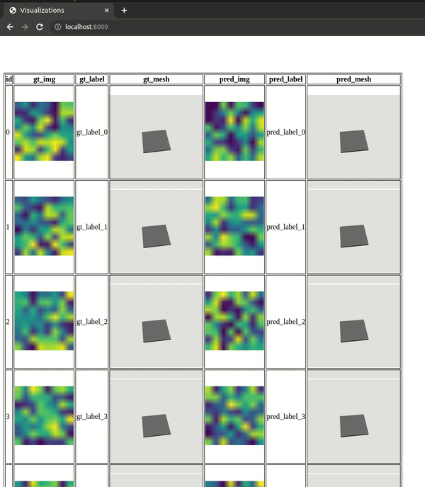

# Vis-eval: Visualization tool for your evaluation folder 

## Installation:
```
pip install viseval
```

## Usage:
`viseval.Table` takes in a list of dicts. Every element in the list indicates
a row in the HTML visualization. Each dict should contain column-name: image-path.

```python
from viseval import Table

eval_dir = Path("eval_results")
# Vis data is a list of dictionaries.
# - Each element in the list corresponds to a row in the table.
# - Each key:value pair in a dictionary represents column-name: column-data.
vis_data = []
vis_data.append({
    "gt_img": eval_results / "0_gt.png",
    "pred_img": eval_results / "0_gt.png",
    "gt_mesh": eval_results / "0_gt_mesh.obj",
    "pred_mesh": eval_results / "0_pred_mesh.obj",
    "gt_label": "0_gt_label",
    "pred_label": "0_gt_label",
})
# Populate vis data with the image / mesh path, text data in your eval folder.

# Once populated, save visualization table as html file
table = Table.from_list_dict(vis_data, eval_dir)
html_path = table.generate()
```

For demo, you can run `python examples/demo.py`. To visualize the generated html file, run a simple `python -m http.server` from inside the evaluation directory and open [localhost:8000](localhost:8000) url in any web browser:



## Acknowledgement:
This idea and the repository is built on a tool I used in [Professor Shuran's lab](https://cair.cs.columbia.edu/index.html).
The initial code is written via [Zhenjia Xu](https://www.zhenjiaxu.com/).
