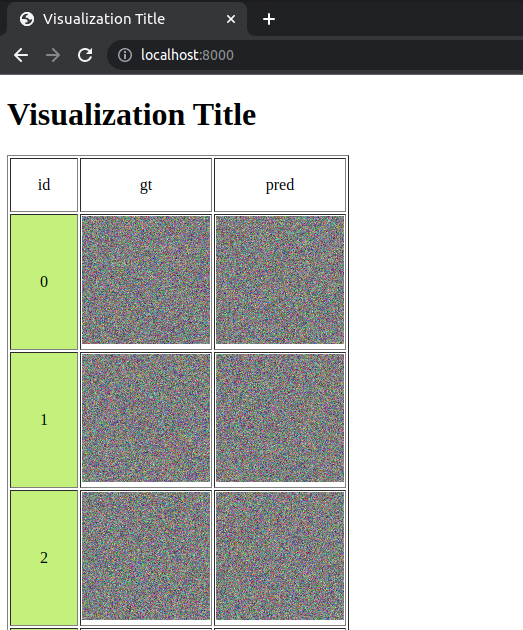

# Vis-eval: Visualization tool for your evaluation folder 

## Installation:
```
pip install viseval
```

## Usage:
`viseval.visualize_helper` takes in a list of dicts. Every element in the list indicates
a row in the HTML visualization. Each dict should contain column-name: image-path.

```python
from viseval import visualize_helper

eval_dir = Path("eval_results")
gt_img_paths = []
pred_img_paths = []

# Add your standard model evaluation code here:
# - Save gt and predicted images inside eval_dir
# - Add corresponding img paths in gt_img_paths and pred_img_paths list

# Save html visualizations
visualization_rows = [
    {"gt": gt_img_path, "pred": pred_img_path}
    for gt_img_path, pred_img_path in zip(gt_img_paths, pred_img_paths)
]
html_path = visualize_helper(visualization_rows, eval_dir)
print(html_path)
```

To visualize the generated html file, use either of the following method:
- Open the html file in a browser
- Run a simple python http server from inside the evaluation directory and open
[localhost:8000](localhost:8000) url:
```sh
python -m http.server
```


## Acknowledgement:
This idea and the repository is built on a tool I used in [Professor Shuran's lab](https://cair.cs.columbia.edu/index.html).
The initial code is written via [Zhenjia Xu](https://www.zhenjiaxu.com/).
